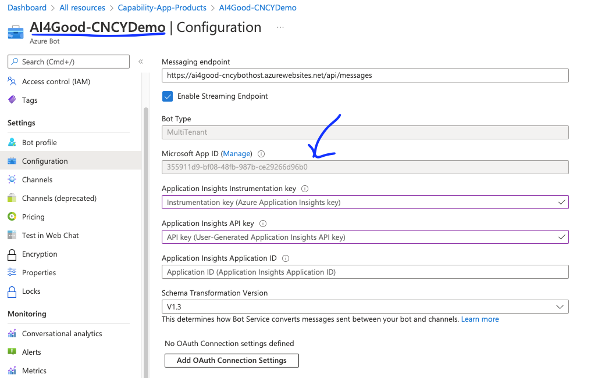
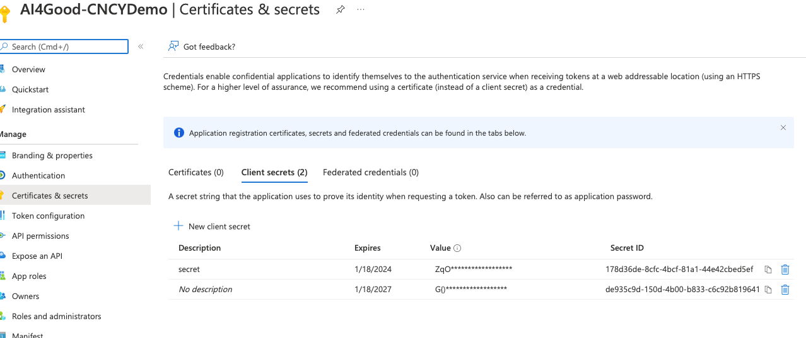
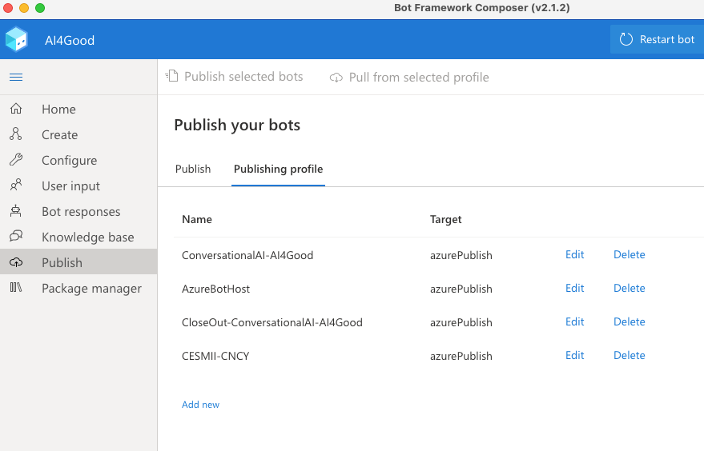
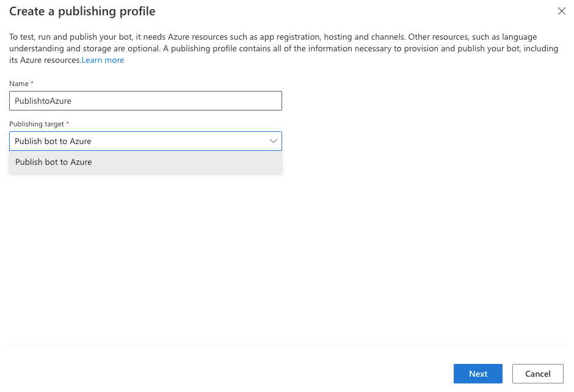
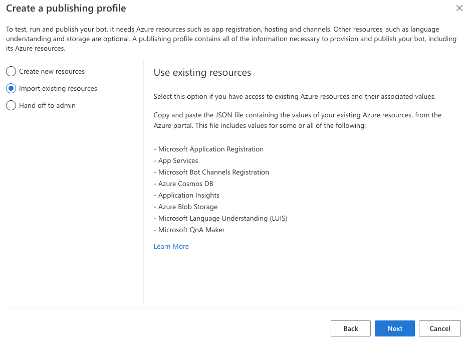

# Azure Bot Setup and Deployment
1. Ensure Web App is deployed to Azure
2. Ensure QnA Maker is provisioned
3. Ensure LUIS is provisioned
4. Create an Azure Bot Resource
5. Record the following:
   1. Microsoft App ID
      
   2. Microsoft App Name for the Bot
   3. Microsoft App Password
      1. Click Manage
      2. Click new secret 
      3. Record the secret - this will be the app password for the bot
      
6. Record the following:
   1. The tenant ID of your Azure subscription
   2. The subscription ID of your Azure subscription
7. Open the bot int the Azure Bot Composer
8. Click Publish
   1. Click Add New:
   
9. Create a new profile
   1. Enter the name of the profile
   2. Select publish bot to azure as the target
   
10. Select import existing resources and click next

11. Update the recorded information in the settings file
[Sample settings file](images/azure-bot/settings.json)