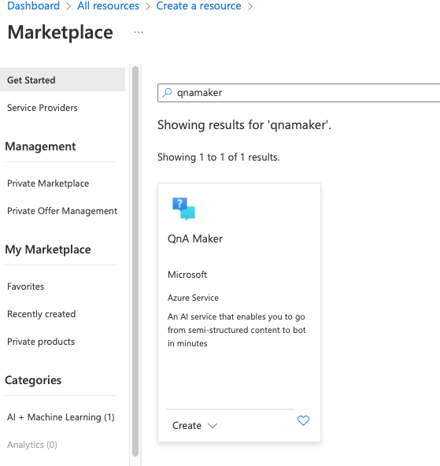

# QnA Maker Setup
1. Login to your Azure Tenant [portal.azure.com](https://portal.azure.com)
2. Click on "Create a resource"
3. Search for and click on "QnA Maker"

4. Click Create
5. Project Details
    1. Select the subscription that you will be using to host QnA Maker.
    1. Select the resource group to house QnA Maker.
    1. Name the QnA Maker resource. We chose ConversationalAI-QnaMaker
    1. Select the pricing tier. If you are unsure what to select contact your Azure administrator.
6. Azure Search details - for data    
7. Azure Service details - for runtime
    1. The app name should be provided for you and should be the same as the project name (ConversationalAI-QnaMaker)
8. App insights details
    1. Select Enable. Note: This is optional but can make troubleshooting much simpler.
9. Click on Review + create
    
10. Setup completed