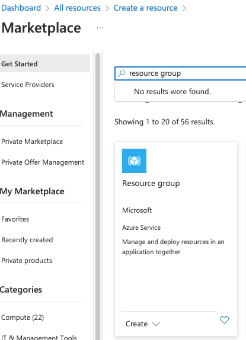
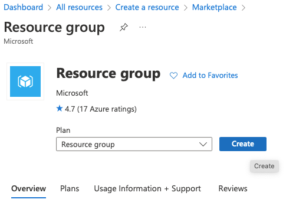
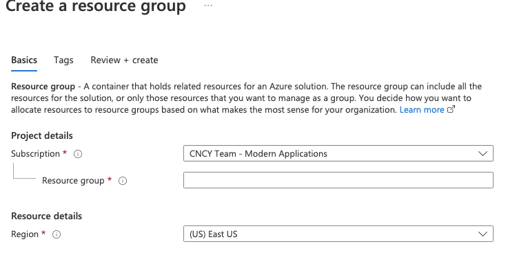

# Azure Resource Group Setup
1. Login to your Azure Tenant [portal.azure.com](https://portal.azure.com)
2. Search for and click on "Resource Group"

3. Click Create

4. Select the subscription that you will be using to host the resource group.
5. Name the resource group. You will need to remember the name throughout this process we use Ai4Good.
6. Select an approate region reletave to your location.
7. Click on Review + create
   
8. Setup completed