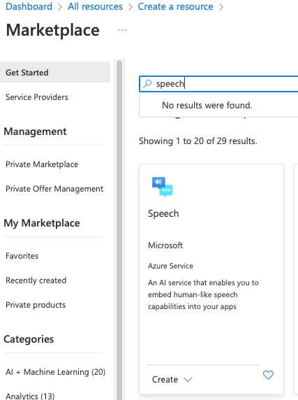
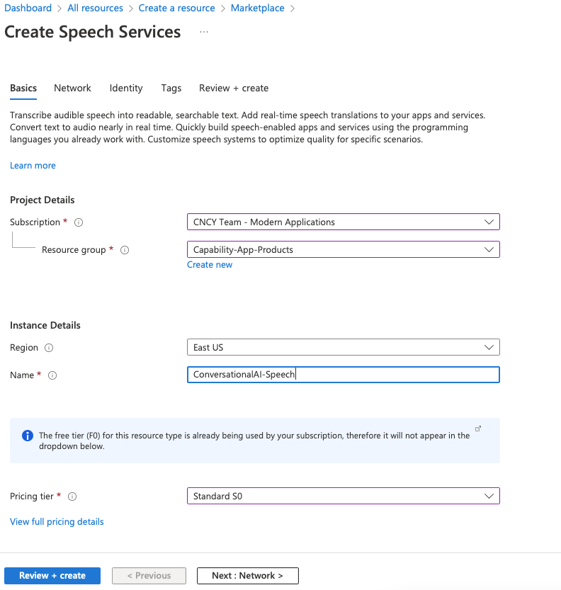

# Speech Setup
1. Login to your Azure Tenant [portal.azure.com](https://portal.azure.com)
2. Click on "Create a resource"
3. Search for and click on "Speech"
   
4. Click Create
5. Name the speech resource. We chose ConversationalAI-Speech
6. Select the subscription that you will be using to host the speech resource.
7. Select an appropriate region relative to your location.
8. Select the pricing tier. If you are unsure what to select contact your Azure administrator.
10. Click on Review + Create
    
11. Setup completed